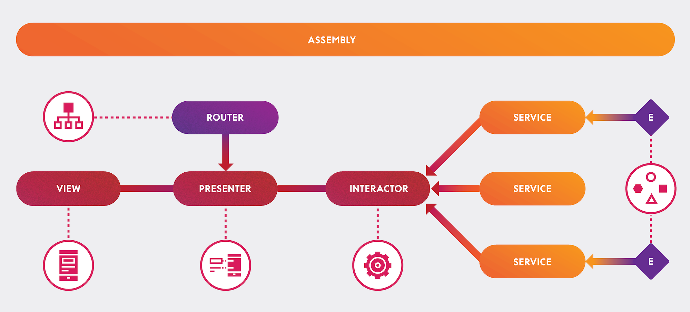

# Idealista Challenge iOS 

En las siguientes líneas intentaré explicar lo mejor posible como he guiado el desarrollo de esta prueba técnica.

## Arquitectura

Para la arquitectura de la aplicación he optado por utilizar VIPER (View, Interactor, Presenter, Entity, Router). Siendo una de las arquitecturas en las que me siento más cómoda a la hora de estructurar el código. En el siguiente diagrama expongo un poco la interconexión de las capas.

El motivo principal de utilizar esta arquitectura es la capacidad que nos ofrece para desacoplar el código y las responsabilidades entre las distintas capas. Liberando la responsabilidad de los ViewControllers  (muy utilizados en otras arquitecturas como MVC) y delegando gran parte de su funcionamiento y lógica a los Presenter e Interactor, encargados de llevar gran parte del peso de la lógica de presentación y negocio de la aplicación.

Este tipo de estructuración nos permite ganar escalabilidad y facilita la detección y corrección de errores. Permitiéndonos modificar diferentes capas de la aplicación sin que se vean afectadas las otras.

## Decisiones técnicas
#### Arquitectura y modelos
He organizado la funcionalidad descrita en la prueba técnica a través de módulos, por ejemplo: 

 - Listado de anuncios.
 - Detalle de anuncios. 
 
Donde cada uno de ellos contiene las capas y/o componentes necesarios para llevar a cabo su propósito (View, Presenter, Interactor, Router, Data Source).

A parte de ello, establezco tres tipos de modelos dentro de la aplicación. 

 - Api Model
 - Entity Model
 - Ui Model

Cada uno de ellos tiene una finalidad particular. En el caso concreto del Api Model es la fiel representación del modelo que se obtiene del servicio (API REST) y su uso esta limitado a la capa de Data. En el caso del Entity Model es la representación usada en la capa de Dominio (Interactor) que se utiliza para albergar, manipular y/o tratar los datos obtenidos. Por otro lado el Ui Model es la unidad de representación minima necesaria en la capa de Vista para hacer llegar los datos a mostrar y poder interconexionar con lógica de representación y operación, por poner un ejemplo el modelo `AdUIModel` contiene las propiedades y métodos básicos para representar la celda de anuncio así como su acción asociada al pulsar sobre un elemento del listado (`ModuleTableView`) provocando la navegación al módulo de detalle a través del Router.

#### Construcción de vistas 

 La creación y construcción del diseño de la vista se realiza mediante programación, de una manera declarativa y desde mi punto de vista más legible. Lo hago así porque, según mi experiencia, en la mayoría de ocasiones tenemos la necesidad de construir jerarquías de vistas complejas y/o vistas muy elaboradas, donde la potencia de los XIBs o StoryBoards es bastante limitada.
 
En mi opinión una de las mayores ventajas de crear vistas mediante programación es que la mayoría de los conflictos y la mala capacidad de mantenimiento de .xibs y StoryBoards se mitigan en gran medida, lo que facilita que varios desarrolladores colaboren en el mismo proyecto.

#### Inyección de dependencias  

La inyección de dependencia se realiza de a través del Router de cada módulo, donde se genera la jerarquía completa del módulo con todos sus componentes. Esta inyección se realiza por contrato, es decir, cada componente expone un constructor definido con los sub-componentes necesarios para construir el módulo.

